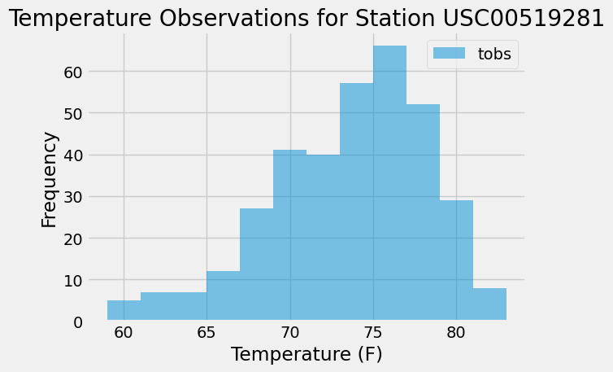

# Unit 10 Homework: Surf's Up

This notebook uses Python and Pandas to analyze climate data in Hawaii from a SQLite database.

#### Requirements

* pandas
* numpy
* matplotlib
* sqlalchemy
* hawaii.sqlite database
* datetime
* Flask

##### Usage

**Precipitation Analysis**

The code finds the most recent date in the data set and a query retrieves the ast 12 months of precipitation data, sorts the values by date, plots the reults and then prints the summary statistics.

**Station Analysis**

The code then queries to calculate the total number of stations in the dataset, finds the most active stations, and then calculates the lowest, highest, and average temperature on the most active station id found. A histogram is then plotted to show the temperature observations for the most active station during the past 12 months.

**Climate App**

To use this Flask API, run the code in a terminal window and navigate to the desire route in a web browser.

1. `/ `- Lists all the available routes
2. `/api/v1.0/precipitation` - Returns the JSON representation of the last 12 months of data (date as key, prcp as value)
3. `/api/v1.0/stations` - Returns a JSON list of stations from the dataset
4. `/api/v1.0/tobs` - Returns a JSON list of temperature observations for the previous year from the most active station
5. `/api/v1.0/<start>` - Returns a JSON list of the minimum temperature, the average temperature, and the maximum temperature for all dates greater than or equal to the start date.
6. `/api/v1.0/<start>/<end>` - Returns a JSON list of the minimum temperature, the average temperature, and the maximum temperature for all dates between the start and end dates.

* Return a JSON list of the minimum temperature, the average
  temperature, and the maximum temperature for a specified start or
  start-end range.
* For a specified start, calculate `TMIN`, `TAVG`, and `TMAX` for all the dates greater than or equal to the start date.
* For a specified start date and end date, calculate `TMIN`, `TAVG`, and `TMAX` for the dates from the start date to the end date, inclusive.
